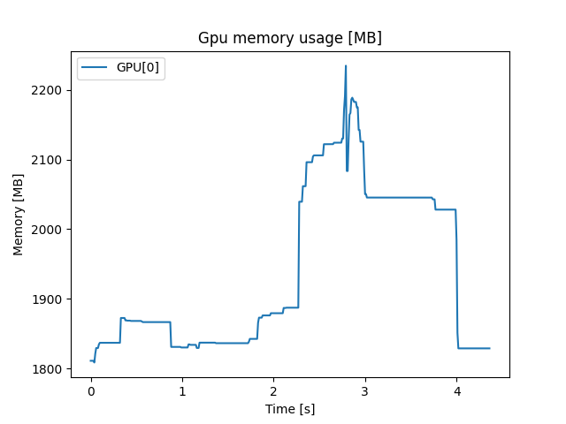

# gpu-link
A tool for monitoring and displaying GPU stats

## Installation
1. Create a virtual python environment: `python -m venv gpu-link`
2. Enter the environment: `.\gpu-link\Scripts\Activate`
3. Install python packages: `pip install -r requirements.txt`

## Usage
```
usage: gpu-link.py [-h] [-o OUTPUT]

GPU-Link memory tracing

optional arguments:
  -h, --help            show this help message and exit
  -o OUTPUT, --output OUTPUT
                        Path to memory graph plot.
```

## Example
1. Enter the environment: `.\gpu-link\Scripts\Activate`
2. Run recording `python gpu-link.py -o memory_consumption.png`
3. Stop recording *Ctrl+C*
4. Plot is saved to `memory_consumption.png`.

### Output
```
GPU[0]: max memory consumption: 2234.70703125[MB]  
GPU[0]: min memory consumption: 1808.6171875[MB]
```


